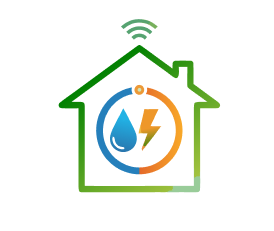

# 🛠️ ISUMS Staff App

<div align="center">
  
  
  **Ứng dụng dành cho Nhân viên Kỹ thuật**
  
  [](https://reactnative.dev/)
  [](https://expo.dev/)
  [](https://www.typescriptlang.org/)
</div>

---

## 📋 Mô tả

ISUMS Staff App là ứng dụng mobile **dành riêng cho nhân viên kỹ thuật** (role `technical`), được tách từ ISUMS gốc. Ứng dụng hỗ trợ quản lý ticket sửa chữa, lịch làm việc, thiết bị (category, item), quét QR/NFC, và thông báo.

## 🚀 Công nghệ sử dụng

### Core Framework
- **React Native 0.81.5** - Framework phát triển ứng dụng mobile
- **Expo ~54.0.29** - Toolchain và platform cho React Native
- **TypeScript 5.9.2** - Ngôn ngữ lập trình với type safety
- **React 19.1.0** - UI library

### State Management & Data Fetching
- **Zustand 5.0.9** - State management (quản lý state dùng chung)
- **React Query (@tanstack/react-query) 5.90.12** - Quản lý server state và API calls
- **Axios 1.7.0** - HTTP client để gọi API

### Navigation
- **@react-navigation/native 7.1.26** - Navigation library
- **@react-navigation/native-stack 7.9.0** - Stack navigator
- **@react-navigation/bottom-tabs 7.9.0** - Bottom tab navigator

### Features & Libraries
- **expo-camera ~17.0.10** - Camera và QR code scanning
- **react-native-nfc-manager 3.17.2** - NFC tag scanning
- **expo-linear-gradient ~15.0.8** - Gradient UI components
- **react-native-svg 15.12.1** - SVG support
- **@expo/vector-icons ^15.0.3** - Icon library

## 📁 Cấu trúc thư mục

```
ISUMS_STAFF_APP/
├── src/
│   ├── features/
│   │   ├── staff/                     # Màn hình Staff
│   │   │   ├── screens/
│   │   │   │   ├── staffHome/
│   │   │   │   ├── staffHouse/
│   │   │   │   ├── staffItems/
│   │   │   │   ├── staffCategory/
│   │   │   │   ├── staffTicket/
│   │   │   │   ├── staffCalendar/
│   │   │   │   └── staffnotification/
│   │   │   ├── modal/assignNFC/
│   │   │   ├── context/
│   │   │   └── data/mockStaffData.ts   # Mock (xóa khi có API)
│   │   ├── screens/                   # Login, Onboarding, UserProfile
│   │   └── modal/camera/              # Camera (QR + NFC)
│   ├── shared/
│   │   ├── components/
│   │   ├── hooks/
│   │   ├── services/
│   │   ├── api/
│   │   ├── theme/
│   │   ├── types/
│   │   ├── styles/
│   │   ├── i18n/
│   │   └── utils/
│   ├── navigation/
│   └── store/
├── assets/
├── docs/
│   └── SPECIFICATION.md
├── App.tsx
├── index.ts
├── app.json
├── package.json
└── tsconfig.json
```

## 🛠️ Cài đặt và chạy

### Yêu cầu hệ thống

- Node.js (phiên bản 18 trở lên)
- npm hoặc yarn
- Expo CLI (hoặc Expo Go app trên điện thoại)

### Cài đặt

1. **Clone repository:**
   ```bash
   git clone <repository-url>
   cd ISUMS_STAFF_APP
   ```

2. **Cài đặt dependencies:**
   ```bash
   npm install
   ```

3. **Chạy ứng dụng:**
   ```bash
   npm start
   ```
   
   Hoặc chạy trên platform cụ thể:
   ```bash
   npm run android    # Chạy trên Android (yêu cầu Android Studio)
   npm run ios        # Chạy trên iOS (chỉ macOS, yêu cầu Xcode)
   npm run web        # Chạy trên web browser
   ```

4. **Quét QR code với Expo Go:**
   - Mở app **Expo Go** trên điện thoại
   - Quét QR code hiển thị trên terminal
   - Ứng dụng sẽ tự động load

   **Lưu ý:** Camera và NFC chỉ hoạt động trên thiết bị thật. Để test đầy đủ, cần build development build.

## 🎯 Tính năng chính

### Xác thực
- ✅ Đăng nhập qua Keycloak (chỉ role `technical`)
- ✅ Quản lý session với token và refresh token

### Quản lý Ticket
- ✅ Danh sách ticket (filter theo status/priority)
- ✅ Chi tiết ticket, nhận ticket, đặt lịch

### Lịch làm việc
- ✅ Xem lịch tuần, đăng ký slot tuần sau
- ✅ Calendar với slot 8h–18h

### Quản lý Thiết bị
- ✅ Danh mục (Category) – CRUD
- ✅ Thiết bị (Item) – CRUD, chi tiết
- ✅ Chi tiết Building (danh sách thiết bị, gán NFC)
- ✅ Quét QR/NFC để tra cứu hoặc gán thiết bị

### Khác
- ✅ Thông báo (Notifications)
- ✅ Hồ sơ người dùng (User Profile)

### Kỹ thuật
- ✅ TypeScript, Zustand, React Query
- ✅ Hỗ trợ Android, iOS và Web
- ✅ Safe Area handling

## 🔐 Permissions

- `CAMERA` - Quét QR code và chụp ảnh thiết bị
- `NFC` - Đọc NFC tags

## 📚 Tài liệu tham khảo

- [docs/SPECIFICATION.md](./docs/SPECIFICATION.md) - Đặc tả chi tiết, kịch bản form, mock data
- [React Native Documentation](https://reactnative.dev/docs/getting-started)
- [Expo Documentation](https://docs.expo.dev/)
- [React Navigation](https://reactnavigation.org/)

## 👤 Tác giả

**Anh Khoa FPT**

- GitHub: [@Anh-Khoa-fpt](https://github.com/Anh-Khoa-fpt)

## 📄 License

This project is private and for educational purposes only.
